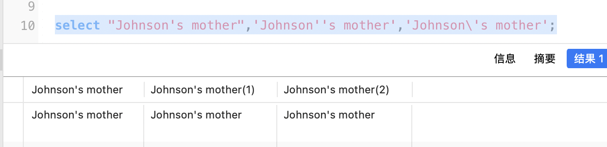
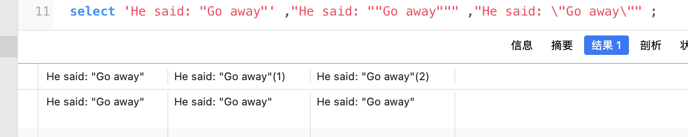

## 目录

- [单引号，双引号](#单引号，双引号)
  - [单引号](#单引号)
- [双引号](#双引号)
- 反引号

## 单引号，双引号

MySQL里引用字符串常量时需要用一对英文单引号“ ' ”或英文双引号“ " ”将字符串常量常量括起来。例如：

```sql
'an apple'

"a book"
```


## 单引号

一般应使用英文单引号，如果字符串内需要包含单引号时，除了使用转义的办法外，我们可以选用一对双引号来包括字符串，这样字符串内的单引号被视作普通字符，无需特殊处理。


```sql
-- 例如  Johnson's mother

select "Johnson's mother",'Johnson''s mother','Johnson\'s mother';
```




## 双引号

与单引号对应，使用英文双引号引用的字符串内需要包含双引号时，除了使用转义的办法外，我们可以用一对单引号来包括字符串，这样字符串内的双引号被视作普通字符，无需特殊处理。

```sql
-- 例如  He said: "Go away" 

select 'He said: "Go away"' ,"He said: ""Go away""" ,"He said: \"Go away\"" ;
```




## 反引号

反引号，一般在ESC键的下方。**它是为了**区分**MYSQL的**保留字**与**普通字符**而引入的符号。**

MySQL里使用一对反勾号“ ` ”将识别符括起来，一般情况下可以不用，**单是如果识别符出现关键字冲突或标识符的写法可能产生歧义的情况下就必须使用**。例如：

```sql
create table t1 (id int primary key ,desc varchar(10)); -- 这句会报错

create table t1 (id int primary key,`desc` varchar(10)); -- 这句可成功运行
```


另外，如果SQL服务器模式包括ANSI_QUOTES模式选项，还可以用双引号替代反勾号将识别符括起来：

```sql
mysql> CREATE TABLE "test" (col INT); 
 ERROR 1064: You have an error in your SQL syntax. (...)mysql> SET sql_mode='ANSI_QUOTES';mysql> CREATE TABLE "test" (col INT);Query OK, 
0 rows affected (0.00 sec)
```

之前报错，设置SQL服务器模式包括ANSI_QUOTES模式后，运行成功。

举个例子：

```sql
SELECT `select` FROM `test` WHERE select='字段值'
```

在test表中，有个select字段，如果不用反引号，MYSQL将把select视为保留字而导致出错，所以， **有MYSQL保留字作为字段的，必须加上反引号来区分。**
另外： **建表的时候一般都会将表名，库名都加上反引号来保证语句的执行度。**反引号`，数字1左边的符号。
保留字不能用于表名，比如desc，此时需要加入反引号来区别，但使用表名时可忽略反引号。

```sql
create table desc    报错
create table `desc`  成功
create table `test`  成功
drop table test      成功
```


保留字不能用于字段名，比如desc，此时也需要加入反引号，并且insert等使用时也要加上反引号。

```sql
create table `test`（`desc` varchar(255)）  成功
insert into test(desc) values('fxf')       失败
insert into test(`desc`) values('fxf')     成功
```


