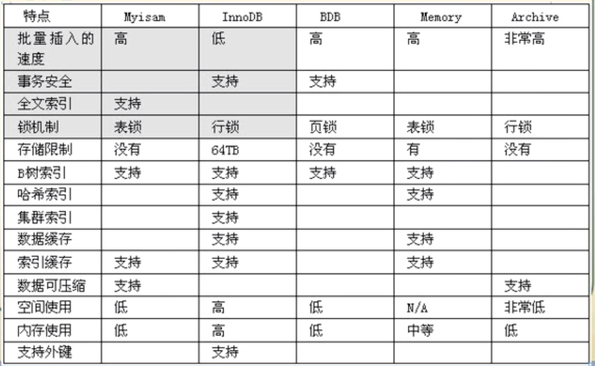

# MYSQL引擎,表锁和行锁 以及事务

## MYSQL引擎



## 表锁和行锁

### MyISAM 表锁  : 需要改变表的存储类型才可以使用,  类型变更为\(MyISAM\) ,而且是串行的.

#### MyISAM的表锁有两种模式:  _表共享读锁\(TABLE READ lock\)_  和    _表独占写锁 \(TABLE WRITE LOCK\)_

#### _一个用户对某个表加上了  读或写锁,  那么这个用户就不允许访问其他的表和库._

### 给表加锁 

1. **加共享读锁:** 加锁之后,其他用户只能读  , 但是会 阻塞写和修改操作, 等待解锁后执行. 但是给表加锁的用户可以正常访问,但是**不可以修改和插入数据, 而且不可以查看和修改 除加锁表之外的任何表!!.**
   1.  _**`mysql>   LOCK  TABLE  表名   READ` ;          \#正常加锁,**_
   2. _**`mysql>  LOCK   TABLE   表名  AS  别名    READ`;            \#加锁和加别名锁. 可以进行别名访问**_
   3. _**`mysql>  LOCK  TABLE   表名1 READ , 表名2 WRITE;`       \# 同时锁多个表, 给出表名和锁的类型.**_
   4. _\*\*\*\*_
2. **表 独占写锁:**  加锁之后, 其他用户的  读和写  都会被阻塞, 等待解锁后执行. 但是给表加锁的用户可以正常访问和修改以及插入数据. **但是不可以查看 除加锁表之外的任何表!!!**
   1. _**`mysql>  LOCK   TABLE   表名  WRITE ;`          \#正常加锁**_
   2. _**`mysql>  LOCK    TABLE   表名   AS 别名  WRITE` ;        \#也是别民和正常加锁**_
   3. _**`mysql>  LOCK  TABLE   表名1 READ , 表名2 WRITE;`        \# 同时锁多个表, 给出表名和锁的类型.**_

### 解锁     

* _`mysql>   UNLOCK  TABLES;`_   

### 并发插入

#### MyISAM  表的读和写是串行的,  但这是就总体而言的.  在一定条件下   MyISAM 表也支持查询和插入操作的并发进行.

#### SyISAM 存储引擎有一个系统变量  concurrent\_insert,  专门用以控制其并发插入的行为, 值分别为 0, 1 ,2 .其中 1 是是默认值, 在存储中表现为  VALUE =  AUTO     

* 当concurrent\_insert 设置为**0** 时,  不允许并发插入
* 当concurrent\_insert 设置为**1** 时,  如果MyISAM 表中没有**空洞**_\( 即表的中间没有被删除的行 \)_, MyISAM**允许在一个进程读表的同时**,  另一个**进程**从**表尾插入记录**.  这也是 **MySQL** 的默认设置.
* 当concurrent\_insert  设置为**2** 时, 无论 MyISAM 表中有没有**空洞,  都允许在表尾并发插入记录.**

```sql
# 首先需要设置好 我们所需要并发插入的系统变量的行为级别.  0   1   2
mysql>  USE  test;        # 首先进入一个库
mysql>  SHOW GLOBAL variables  like 'concurrent_insert';  #查询并发级别,默认的 AUTO  = 1;
mysql>  SET  GLOBAL  concurrent_insert = 2;       #这样来修改系统变量级别.


--------- 读并发 , concurrent_insert 设置为2  --------------------------
# 设置一个 允许并发 读  的一个锁.(首先我需要在一个库内,以及完成了设置并发变量操作的值为 2 )
mysql>  SET  GLOBAL  concurrent_insert = 2;
mysql> LOCK TABLE  表名 READ LOCAL;     # 后面的LOCAL,是表示并发的关键字. 前面是读锁

# 接下里说明执行了 允许并发读  命令之后会发生的事情: (用户 A 执行了并发锁 命令)
    # 执行 加锁读并发 的用户 A , 不允许向表内插入数据和修改数据,只能读取,而且读取的是执行命令之后
    # 系统生成的表快照, 也就是说, 其他用户是可以对 加了 读锁并发 的表进行任何操作(增删改查都可以),
    # 但是 A 用户是看不到 其他用户所进行的任何修改, 他只可以查看当时上锁的表内的数据.
# A 用户执行任何 修改,插入,删除 语句都会报错  1099这错误.
# 其他用户毫无影响,任何命令都可以执行.

#A 用户执行 解锁操作之后会发生的情况:
mysql> UNLOCK TABLES;

# A 用户一直在查看的是系统生成的表快照, 一旦解锁,快照消失. A用户访问的就是真正的表了.
# 对其他用户毫无影响.
------------------------------------------
***************************************


--------- 读并发 , concurrent_insert 设置为1  --------------------------
# 设置一个 允许并发 读  的一个锁.(首先我需要在一个库内,以及完成了设置并发变量操作的值为 1 )
mysql>  SET  GLOBAL  concurrent_insert = 1;
mysql> LOCK TABLE  cb  READ LOCAL;

# 用户A 执行了以上  读并发命令, 并且设定值为1 , (默认也是1)
# 假设这个表 cb  曾经被删除过数据, 那么 并发命令执行后,其他用户的 写操作会被阻塞, 读操作可以进行.
# 那么A 用户可以进行查询操作, 但是也无法进行修改和插入操作. 而且也无法查看和修改其他表.

#A用户执行解锁命令
mysql> UNLOCK  TABLES;

#执行解锁命令之后, 其他用户阻塞的 修改操作会被直接执行.  A用户也可以进行任意操作了.
------------------------------------------
***************************************
```

### MyISAM  锁调度

#### 当一个进程请求某个 MyISAM表的 '读锁' ,  同时另外一个进程也请求同一个表的 '写锁' , MyISAM 会进行如下处理:

> 写进程先获得锁.   即使 读锁 请求先到 锁等待队列, 写锁 请求后到,  那么写锁也会插到读锁队列之前, 进行优先执行.           
>
> MyISAM  认为 写请求比 读请求更重要.  MyISAM 不太适合有大量更新操作和查询操作的原因, 因为大量的更新操作会造成查询操作很难获得读锁, 从而可能永远阻塞.
>
> #### 解决方法
>
> 执行 **`mysql>  SET low_priority_updates = 1`** ;        使该连接发出的更新请求\(写锁\) 优先级降低. 
>
> 其中  INSERT , DELETE 也可以通过此方法指定.\(  `low_priority_inserts = 1`,   `low_priority_deletes = 1`\)


## 事务

_**事务应该具有4个属性:  原子性, 一致性, 隔离性, 持久性.**_

* _**原子性:**_   两步或N步操作, 逻辑上不可分割. 要么成功,要么都不成功.
* _**一致性:**_   操作前后,值的变化, 逻辑上成立. \(出现溢出就不算成立\)
* _**隔离性:**_ 事务结束前,每一步的操作带来的影响,别的会话看不见.
* _**持久性:**_  事务一旦完成, 无法撤销, \(未完成时 也就是失败了,可以撤销\).

_**目前一般使用 Innodb 引擎**_ 

#### 如果未开启事务,只 执行 正常的 SQL 语句, 那么当你执行的适合,数据库会隐式的帮你 提交.

### 事务开启, 提交, 回滚.

```sql
#开启事务
mysql> start transaction;

#事务完成,提交, 结束事务, 将事务操作应用在表上.
mysql> commit;

#事务失败,回滚
mysql> rollback;
```


