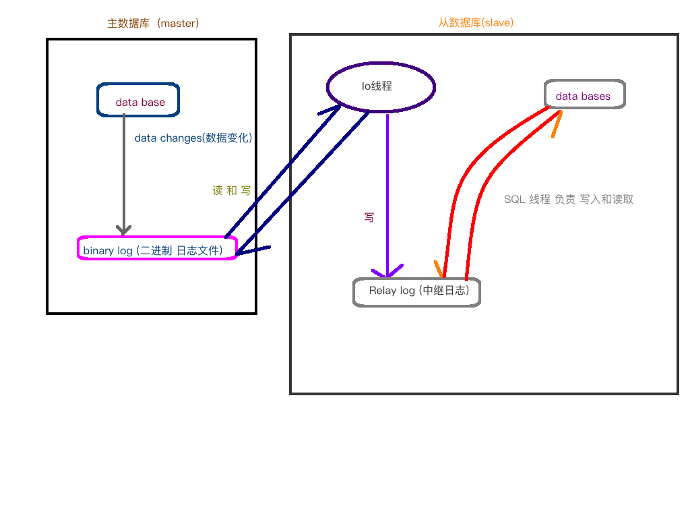

# 分析海量数据和主从同步 复制

## 分析海量数据

### 模拟海量数据   使用存储过程/存储函数

```sql
# 通过存储函数 插入海量数据
# 准备工作 ,  创建两个表  ,创建两个存储函数 和一个存储过程  , 用来批量插入数据

mysql>  CREATE  database testdata;   
mysql>  use  testdata;

mysql> create table dept(                         #创建一个部门表
        dno int(5) PRIMARY KEY DEFAULT 0, 
        dname varchar(20) not null default '', 
        loc varchar(30) default '' 
        )engine innodb default charset utf8;
        
mysql>  CREATE  table  emp (                       #员工表
        eid int(5) PRIMARY key,
        ename varchar(20) not null default '',
        job varchar(20) not null default '',
        deptno  int (5) not null default 0
        )ENGINE Innodb default charset=utf8;
        
mysql>  SET global  log_bin_trust_function_creators=1;      #开启创建函数
mysql>  delimiter  $$;                              #创建存储函数之前,修改分号含义
mysql>  CREATE  function randstring(n int) returns varchar(255)    #创建随机数函数,需要一个int参数,返回字符串
        begin
           declare  all_str varchar(100) default 'qwertyuiopasdfghjklzxcvbnmQWERTYUIOPASDFGHJKLZXCVBNM';
           declare  return_str  varchar(255) default '';   # 上面是所有字符串,用来进行随机抽取的, 这个存放随机字符串的组合
           declare  i  int default 0;
           while i<n                # 循环, 当i等于传入的n参数时, 循环停止.
           do
               set return_str = concat( return_str, substring( all_str, FLOOR(1+rand()*52) ,1));
               set i = i+1;        # 上面拼接字符串,
           end while;
           return return_str;
        end
        $$;
        
mysql>  CREATE function ran_num()  returns int(5)     #产生随机整数的  存储函数
        begin
           declare i int default 0;
           set i = FLOOR(rand() *100);   #产生 0 到 99 中的随机数,  rand() 只返回0~0.99
           return i;
        end
        $$;

# 通过存储过程插入海量数据到 emp 表中.
#eid_start 员工编号从哪里累加,  data_times 累加次数, ( 100 ,  2000 ) 从100 员工编号开始,插入2000条数据.
mysql> CREATE procedure insert_emp(in eid_start int(10), in data_times int(10))
        begin
           declare i int default 0;
           set autocommit = 0;        #关闭自动提交
           repeat  
               INSERT INTO emp values(eid_start + i, randstring(5), 'other',ran_num());
               set i=i+1;
             until i = data_times        #这里语法上 没有分号
          end repeat;
           commit;  #提交一次
           set autocommit = 1;        #开启自动提交
        end
        $$;

                        
# 通过存储过程插入海量数据到  dept表中, 参数设置和上面一样
mysql> CREATE procedure insert_dept (in dno_start int(10), in data_times int(10))
        begin
           declare i int default 0;
           set autocommit = 0;        #关闭自动提交
            repeat  
               INSERT INTO dept values(dno_start + i, randstring(6),randstring(8));
               set i=i+1;
             until i = data_times        #这里语法上 没有分号
          end repeat;
           commit;  #提交一次
           set autocommit = 1;        #开启自动提交
        end
        $$;

mysql> delimiter ;                #恢复分号含义
mysql> set autocommit = 1;        #开启自动提交


********************************************************************
# 准备过程结束,  插入数据
mysql> set autocommit = 1;        #开启自动提交

mysql>  call insert_emp (1000,800000);      #从编号1000开始插入 八十万条数据
mysql>  call insert_dept (10,30);           #从编号 10 开始,插入30条数据


********************************************************************
# 分析海量数据   profiles : 会记录所有 profiling打开之后的所有 SQL 语句

# 首先分析是默认关闭的,  需要手动开启
mysql>  show variables like '%profiling%';        # 查询状态
mysql>  SET profiling  =  1;                      # 临时开启


# 显示记录的sql语句和执行时间(不精确)
mysql>  SELECT count(1) FROM emp;      # profiles 只会记录开启之后的查询语句,所以先查询一次
mysql>  show profiles;                 #显示记录的sql语句和执行时间(不精确)


# 精确分析,  sql 诊断, 通过上面 show profiles; 中id 返回值来进行分析
mysql> show profile all for query   上一步查询的Query_ID;    # all 表示查看全部
mysql> show profile cpu,block  io for query 上一步查询的Query_ID;     #查看 cpu ,block  的值


# 全局查询日志 : 记录开启之后的全部 sql 语句, (仅可用于开发调试,最终项目上线必须关闭), 默认关闭
mysql>  SHOW variables  like '%general_log%';    #查询目前查询日志功能是否开启
# 1  执行的所有SQL 记录到表中, 在 mysql.general_log 表中.
  mysql>  SET GLOBAL general_log = 1;              #开启全局日志功能
  mysql>  SET GLOBAL log_output = 'table';         #让记录输出到表中, 而不是文件中
  mysql> select * FROM mysql.general_log ;         #查询,  记录的全局查询日志到表中
# 2  执行的所有SQL  记录到文件中. 目录和文件名都可以自定义
  mysql> SET GLOBAL general_log = 1;         #开启全局日志功能
  mysql> SET GLOBAL general_log_file = '/var/lib/mysql/localhost-general.log';   #让记录输出到文件
  mysql> SET GLOBAL log_output = 'file';    #输出到文件
  mysql> select * FROM mysql.general_log ;         #查询,  记录的全局查询日志到文件中

```

## 主从复制   \(集群在数据库的一种实现\)

### 集群:  

* 负载均衡
* 失败迁移

集群的Mysql版本 .不要有太大的差距,  保持主要版本号相同就行.

#### 首先安装 windows 的mysql:

* 如果存在mysql,则删除它,  \(也可以保留\)
  * 卸载mysql,  通过控制面板
  * 删除mysql 缓存文件, C:\ProgramDate\MySQL            这个目录是隐藏文件
  * 删除注册表 regedit 中所有 mysql 相关配置
  * 重启电脑
* 安装  : 去mysql官网, 进入下载页面.  选择上面的 Communiy,  -&gt; MySQL Community Server  --&gt; 在这个页面选择需要下载的版本


### 如果要远程访问数据库, 则需要授权远程访问

#### 服务器 授权远程访问:  \( A 访问 B ,则B需要执行以下命令 \)

* mysql&gt;  `GRANT ALL PRIVILEGES ON *.* TO 'root'@'%'  IDENTIFIED BY 'root' WITH GRANT OPTION;`
* mysql&gt;  `FLUSH PRIVILEGES;`
  * 如果连接仍然报错, 那么可能是 B 防火墙配置出现了问题, 那么可以关闭防火墙
    * bash\#  service  iptables stop             \#关闭防火墙


### 主从复制原理和过程

#### 同步核心:  二进制日志

#### 复制过程

* master \(主\)   将该改变的数据 记录在本地, 二进制文件中\( binary log 二进制日志文件\), 该过程称之为: **二进制日志事件**
* salave\(IO线程\)  将master 的 binary log 拷贝到自己的 relay log \(中继日志\)中.
* 中继日志事件, 通过SQL 线程将日志文件读取到 自己的数据库中.

#### MYSQL主从复制 是异步的. 串行化的, 有延迟.

_**主服务器只存在一个, 而从服务器可以有N多个.**_



### 主从复制实现 : 注意只同步 设置之后的数据和表,曾经的不会同步

#### 准备工作::

windows 服务器IP 是 192.168.200.2     ;    Linux服务器IP是  192.168.200.3

配置服务器, windows 主服务器,  Linux 从服务器

* windows\( mysql: my.ini\)
* Linux\(50-server.cnf\)

配置前, 需要关闭防火墙, 远程访问权限 等进行处理.      Linux 关闭防火墙命令 \# service iptables stop

#### 开始配置 主数据库  \( windows \)

因为windows 是主服务器, 所以需要先设置 windows 的 mysql 服务器配置文件.

* 在 `my.ini`  文件中找到  \[mysqld\]  , 然后在该项目下面添加代码
  * server-id =1         \# 给这台主机添加一个唯一标示,
  * `log-bin = "D:/SQL/mysql/data/mysql-bin"`      \#这个是二进制日志文件位置, \(确保该目录下没有这文件\)
  * `log-error = "D:/SQL/mysql/data/mysql-error"`   \#错误记录日志
  * `binlog-ignore-db = mysql`     \#主从同步时, 忽略的数据库  库名\(比如忽略 mysql 库 \)
  * `binlog-do-db=test1`  \# 指定主从同步时, 同步哪些数据库, 这里写的是同步 test1数据

进入 windows 数据库 输入如下 mysql 命令 , **指定和授权 192.168.200 这个网段的数据库, 全都是自己的从数据库 ,并且允许它的访问.**

*  `mysql> GRANT ALL PRIVILEGES ON *.* TO 'root'@'192.168.200.%'  IDENTIFIED BY 'root' ;` 
*  `mysql>  flush privileges ;`

然后重启 windows 数据库.   

#### 查看主数据库状态 \( 每次在同步前, 必须观察主数据库最新状态,记录使用的 文件File 和 位置 Position\)

*  `mysql>  show master  status;`   \# 获取当前数据库状态, 记录返回的状态值

```sql
mysql> show master status;
+------------------+----------+--------------+------------------+
| File             | Position | Binlog_Do_DB | Binlog_Ignore_DB |
+------------------+----------+--------------+------------------+
| mysql-bin.000001 |      107 | test1        | mysql            |
+------------------+----------+--------------+------------------+
# file: 同步使用的二进制文件 (binary log), 每次服务器重启都会不同, 在同步前需要查看和配置
# Position:  目前数据记录到的位置, 就是文件的最后一个字节的位置
# Binlog_Do_DB:  需要同步的库
# Binlog_Ignore_DB:  不需要同步的库
```

#### 开始配置 从数据库 \( Linux \)

使用终端来修改配置文件: `sudo vim /etc/mysql/mariadb.conf.d/50-server.cnf` 

在配置文件中找到  `[ mysqld ]`   ,在这个位置下面 插入如下代码, 然后重启 mysql 服务

* `server-id = 2`      \# 因为主服务器占用了1 , 所以这里写2, 以此类推, \(但是这个配置有可能出现bug\)
* `log-bin = /var/lib/mysql/mysql-bin`    \#配置二进制日志的位置 \( binary log\)
* `replicate-do-db = test1`       \#需要从主服务器同步  test1 这个数据库

从数据库 Linux 需要授权  哪个是自己的主数据库  \( 也就是同步哪台数据库的数据 \) 

```sql
mysql>  CHANGE MASTER TO                       # 设置你的 主数据库是谁, 是那台机器和编号
        MASTER_HOST = '192.168.200.105',       # 这个是主数据库的 IP
        MASTER_USER = 'root',                  # 登陆主数据库的 用户
        MASTER_PASSWORD = 'iop890',       # 登陆用户的密码
        MASTER_PORT = 3306,                    # 主数据库开启的 mysql 服务的端口
        master_log_file = 'mysql-bin.000001',  # 从主数据库执行 show master status 中的file得到的 二进制日志文件
        master_log_pos = 107;                  # 也是从主数据库中执行命令得到的.
        
# 如果报错:   This operation cannot be performed with a runing slave; run STOP SLAVE first
#        则说明,这台从数据库曾经设置过主从同步, 需要先关闭.
# 解决  :  mysql> STOP SLAVE;         # 执行之后,再次执行上面的语句 
```

#### 从数据库执行完毕上面所有内容后,  就可以开启主从同步了,   在数据库中执行以下语句,开启主从同步

```sql
mysql>  start slave;            #开启主从同步
```

开启成功后,检测状态,  是否同步成功

```sql
mysql>  SHOW slave status \G    #查看同步状态  

# 主要观察两个位置, 确保这两个都是 Yes
            Slave_IO_Running:  Yes
            Slave_SQL_Running: Yes
# 如果有其中一个或两个都不是Yes ,则向下寻找, 这两个数据, 里面有错误提示
                Last_IO_Errno: 2003
                Last_IO_Error:
                
# 查看计算机ID
mysql>  show variables like '%server_id%';
# 如果ID有重复,可以直接使用变量来解决
mysql> SET global server_id =  3;
```

#### 注意:  主从同步是 从新的数据开始的, 主数据库原有的数据 是不会同步到 从数据库中的.

### 取消主从同步

```sql
#首先停止 从服务器 Linux 的同步状态
mysql>  STOP  slave;

#然后 删除 主从 两个数据库的 配置文件中添加的配置

#重启两个数据库  结束:
```


